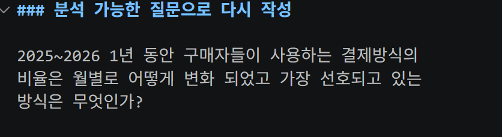
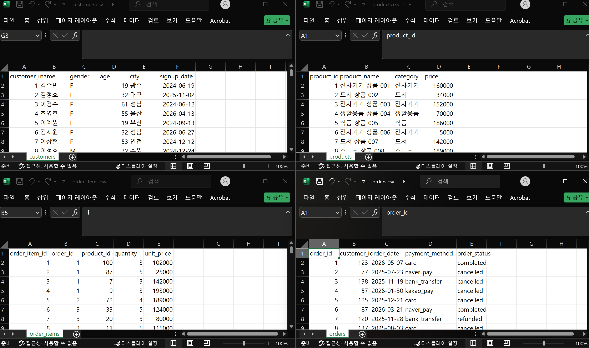
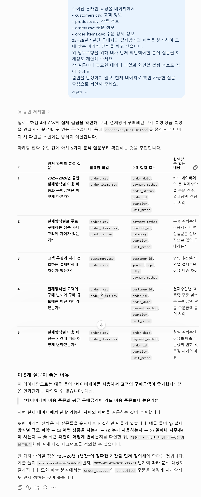
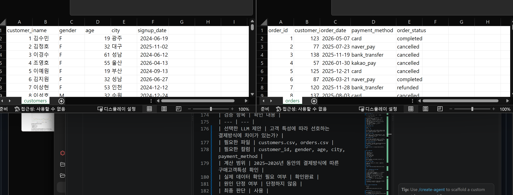
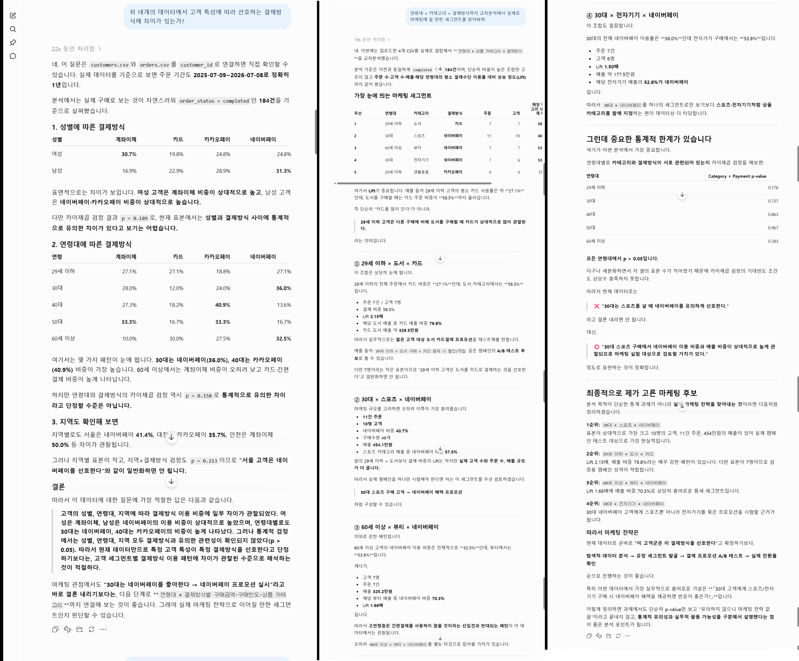
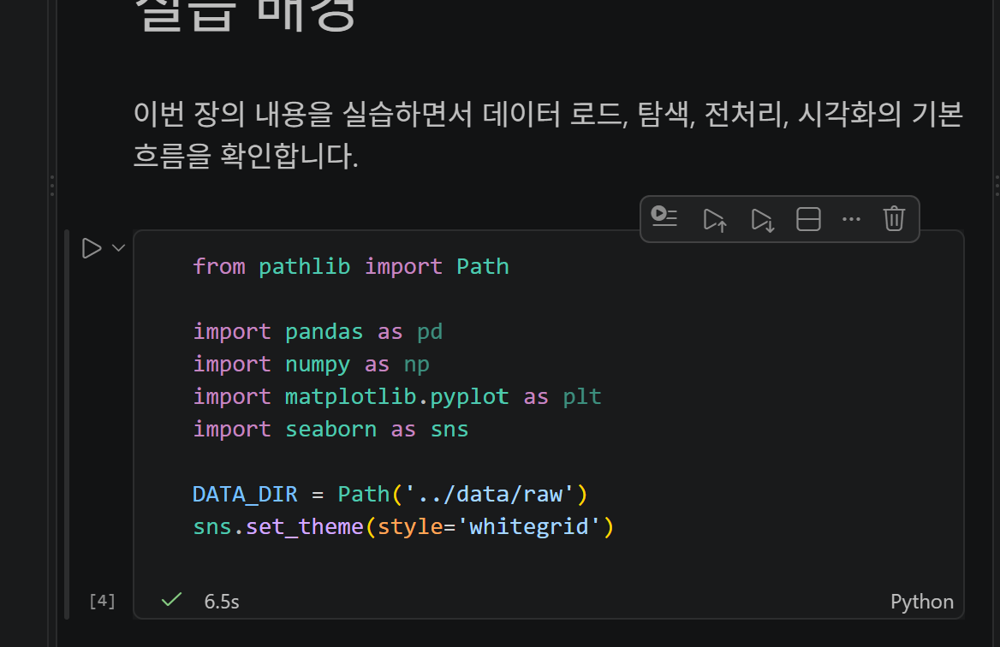

# Chapter 01 제출 답안. AI와 함께하는 데이터 분석의 시작

> 이 파일은 Chapter 01 실습 결과를 정리하여 제출하기 위한 학생용 템플릿입니다.  
> 강사 저장소의 원본 템플릿을 직접 수정하지 말고, 자신의 PC에 복사한 뒤 작성합니다.

---

## 0. 제출 정보

- 이름:김희철
- GitHub ID:KHeeCheol
- 개인 저장소명: `llm-data-analysis-study`
- 작성일:2026-09-07
- 사용한 LLM:chatGPT

### 최종 제출 URL

https://github.com/KHeeCheol/llm-data-analysis-study/blob/main/chapter01/chapter01.md

---

## 1. 원래 업무 질문

### 내가 선택한 막연한 질문

요즘 사람들이 물건을 구매할때 사용하는 방법은 무엇인가요?

### 왜 이 질문이 모호하다고 생각했는가?
기간에 대한 명시가 없고 목적이 명확하지 않음.

- 대상:제품구매의 결제방식
- 기간:2025~2026 1년간
- 기준:월별
- 비교 방법:최근1년 동안의 구매자의 결제방식 변화 
- 분석 목적:최근1년 간 어떤 결제방식이 가장많이 선호되고 있는지 확인

### 분석 가능한 질문으로 다시 작성

2025~2026 1년 동안 구매자들이 사용하는 결제방식의 비율은 월별로 어떻게 변화 되었고 가장 선호되고 있는 방식은 무엇인가?

### 결과 관찰

기간을 정확히 명시하였고 목적을 분명히 작성하였다.

### 나의 해석과 판단

 1년간이란 명확한 기준을 제시하였고 구매할때 사용하는 방법이라는 모호한 말대신 어떤 결제 방식을 실제 사용하였고 비율이 어떻게 변화 하는지 가장많이 선호하는것이 무엇인지 정확하게 질문하여 데이터 분석에 더 적합하다고 판단했다.

### 업무·분석적 의미

사람들이 선호하는 결제방식의 업체와 제휴를 하여 할인이나 혜택을 제공하여 소비자들의 구매를 유도해 볼 수 있다.

### 한계와 추가 확인 사항

결제방식의 결정하는 구매자의 특성이 어떤것인지 확인이 더 필요하다. 

### Evidence



---

## 2. 질문과 필요한 데이터 연결

### 필요한 데이터 파일

- [] `customers.csv`
- [] `products.csv`
- [O] `orders.csv`
- [] `order_items.csv`

### 필요한 컬럼 후보

| 파일 | 필요한 컬럼 | 필요한 이유 |
| --- | --- | --- |
| order.csv | payment_method | 결제방식 확인 |
| order.csv | order_id | 주문확인 |
| order.csv | customer_id | 구매자확인 |
| order.csv | order_date | 구매날짜확인 |


### 데이터 연결 관계

order.csv 에 포함된 칼럼 order_id, payment_method, customer_id, order_date를 통해 선호하는 결제방식 확인가능


### 결과 관찰

주어진 자료에서 지난 25~26 1년간 구매자의 결제방식 확인을 위해서는 결제방식, 구매날짜, 주문ID, 구매자ID 가 필요하다는 사실을 확인했다.

### 나의 해석과 판단

현재 데이터로 구매자의 결제방식 선호비율과 1년동안 선호비율 변화과정을 충분히 확인가능하다.

### 업무·분석적 의미

데이터 구조를 질문과 연결하지 않으면 엉뚱한 자료를 참조해서 결과가 나올 수도 있고 데이터구조를 분석하는데 추가적인 시간이 들기 때문에 정확하고 빠른 결과를 얻기 위해서는 질문과 데이터 구조를 연결하는 것이 중요하다.

### 한계와 추가 확인 사항

필요한컬럼은 확인하였으나 결측치 여부는 확인하지 못함

### Evidence



---

## 3. LLM에게 분석 질문 후보 요청

### 사용 목적

내가 작성한 분석가능한 질문과 LLM이 제안한 분석질문을 비교하여 개선할 부분은 개선하기 위해

### 사용한 Prompt

주어진 온라인 쇼핑몰 데이터에서 
- customers.csv: 고객 정보
- products.csv: 상품 정보
- orders.csv: 주문 정보
- order_items.csv: 주문 상세 정보
25~26년 1년간 구매자의 결제방식과 패턴을 분석하여 그에 맞는 마케팅 전략을 짜고 싶습니다.
위 업무수행을 위해 내가 먼저 확인해야할 분석 질문을 5개정도 제안해 주세요.
각 질문마다 필요한 데이터 파일과 확인할 컬럼 후보도 적어 주세요.
원인을 단정하지 말고, 현재 데이터로 확인 가능한 질문 중심으로 제안해 주세요.


### LLM 답변 요약

LLM의 전체 답변을 그대로 복사하지 말고 핵심 제안 3~5개를 요약하세요.

1.2025~2026년 동안 결제방식별 이용 비중과 구매금액은 어떻게 다른가?
2.결제방식별로 주로 구매하는 상품 카테고리에 차이가 있는가?
3.고객 특성에 따라 선호하는 결제방식에 차이가 있는가?
4.결제방식별 고객의 구매 빈도와 구매 규모에는 어떤 차이가 있는가?
5.결제방식별 이용 패턴은 기간에 따라 어떻게 변화했는가?

### 결과 관찰

LLM은 데이터의 구매자의 결제방식에 따른 모든 패턴을 분석하기 위해 결제방식에 연계되는 구매금액, 고객특성,구매빈도, 구매제품 카테고리를 모두 질문하는 내용을 제안하였다. 

### 나의 해석과 판단

좋았던 제안:
1) 결제방식별로 주로 구매하는 상품 카테고리에 차이가 있는가?  -> 특정 카테고리상품에 대해 많이 쓰이는 결제방식이 있다면 해당 카테고리 구매시 사용하는 결제방식에 혜택이나 할인을 추가하여 구매를 유도하는 전략도 생각이 가능하다.
2) 고객 특성에 따라 선호하는 결제방식에 차이가 있는가?
->고객의 나이나 성별에 따라 선호하는 결제방식을 제안하는 방식을 적용하는 식의 판단이 가능해짐

어려운 제안:
없음

### 업무·분석적 의미

내가 원하는 분석을 위한 생각지 못한 아이디어 제안을 해서 좀더 상세하고 체계적인 분석이 가능하게 해준다. 

### 한계와 추가 확인 사항

모든 제안에 대해서 실제 데이터에서 결제방식별로 구매 구매금액, 고객특성,구매빈도, 구매제품카테고리에 유의미한 차이가 있는지를 확인해 봐야한다.


### Evidence



---

## 4. LLM 제안 검증

LLM 제안 중 하나 이상을 선택해 검토합니다.

| 검증 항목 | 확인 내용 |
| --- | --- |
| 선택한 LLM 제안 | 고객 특성에 따라 선호하는 결제방식에 차이가 있는가? |
| 필요한 파일 | customers.csv, orders.csv |
| 필요한 컬럼 | customer_id, gender, age, city, payment_method |
| 계산 범위 | 2025~2026년 동안의 결제방식에 따른 구매고객특성 확인 |
| 실제 데이터 확인 필요 여부 | 확인완료 |
| 원인 단정 여부 | 단정하지 않음 |
| 최종 판단 | 사용 |

### 내가 수정한 내용

수정하지 않음

### 결과 관찰

현재 LLM의 제안을 검증하는 과정에서는 특별한 문제점은 발생하지 않았다. 필요한 파일과 칼럼을 정확히 이야기 하였고 원인도 섣불리 단정하지 않았다.

### 나의 해석과 판단

위에서 진행한 검증 결과 특별히 오류가 발생한 부분이 없었고 내가 생각하지 못한 부분을 검증하는 제안이므로 그대로 사용하는 결정을 내렸다.

### 업무·분석적 의미

만약 예를 들어 칼럼의 데이터 구조를 제대로 이해하지 못하고 답변하는 경우 엉뚱한 해석결과를 도출해 낼 수 있고 존재하지 않는 칼럼을 제시할 가능성도 있다.

### 한계와 추가 확인 사항

실제 데이터로 고객의 성별,지역,나이에 따른 결제방식에 유의미한 차이가 있는지는 확인하지 못했다.

### Evidence



---

## 5. Prompt Log

- 사용 목적: 구매자 특성에 따라 선호하는 결제방식을 확인
- 입력 Prompt 요약: 구매자 특성에 따라 선호하는 결제방식에 차이가 있는지 확인하고 연령대 × 카테고리 × 결제방식까지 교차분석해서 실제로 마케팅에 쓸 만한 세그먼트를 검색
- LLM 답변 요약: 고객의 성별, 연령대, 지역에 따라 결제방식 이용 비중에 일부 차이가 관찰되었다.그러나 통계적 검정에서는 유의한 관련성이 확인되지 않았다(p > 0.05). 따라서 현재 데이터만으로 특정 고객 특성이 특정 결제방식을 선호한다고 단정불가. 연령대 × 상품카테고리 × 결제방식 이용 패턴또한 유의한 관련성이 발견되지 않았다. 따라서 마케팅 전략은 현재 데이터로 곧바로 "이 고객군은 이 결제방식을 선호한다"고 확정하기보다,
탐색적 데이터 분석 → 유망 세그먼트 발굴 → 결제 프로모션 A/B 테스트 → 실제 전환율 확인
순으로 진행하는 것이 좋습니다
- 실제 반영 여부: 반영진행
- 사람이 검증한 항목: 계산결과가 잘못되거나 데이터 참조가 틀리지 않았는지 확인
- 사람이 수정한 내용: 처음 구매자 특성만 고려한 프롬프트에서 추가로 연령대 × 카테고리 × 결제방식 추가로 검색
- 남은 확인 사항: 실제 유망 세그먼트를 설정하여 마케팅을 진행하고 유의미한 실적을 얻는지 확인이 필요

### 결과 관찰

입력한 프롬프트에서 유의성이 있는지 직접 계산하여 추후 어떻게 프롬프트입력 및 분석을 진행해야 하는지 제안을 하였다.

### 나의 해석과 판단

단순히 LLM 답변을 복사해서 가지고 있는 것보다 어떤 분석과정을 통해서 진행을 했는지 log를 남기는 것을 통해 분석하고자하는 자료를 좀더 깊게 이해하고 통창력있는 결과를 얻을 수 있다.

### Evidence



---

## 6. 개인정보와 Secret 보호 확인

다음 항목을 확인합니다.

- [O] 실제 이름·이메일·전화번호 등 고객 개인정보를 Prompt에 사용하지 않았습니다.
- [O] API Key를 코드나 Notebook에 직접 작성하지 않았습니다.
- [O] `.env` 실제 내용을 캡처하거나 업로드하지 않았습니다.
- [O] GitHub Token, 비밀번호, 내부 URL이 캡처에 보이지 않습니다.
- [O] 제출 전 이미지까지 다시 확인했습니다.

### 나의 판단

비밀번호및 내 개인정보및 타인의 개인정보 사적인 내용을 올리면 안된다고 판단 했습니다.

---

## 7. Chapter 01 Notebook 확인

Notebook:

notebooks/ch01_ai_data_analysis_intro.ipynb


### 내 환경 상태

- [ ] 아직 환경설정 전이라 Notebook 위치만 확인했습니다.
- [O] 환경설정이 완료되어 Notebook을 직접 실행했습니다.

### 환경설정 완료 학생만 작성

#### 실행한 코드

```python
from pathlib import Path

import pandas as pd
import numpy as np
import matplotlib.pyplot as plt
import seaborn as sns

DATA_DIR = Path('../data/raw')
sns.set_theme(style='whitegrid')
```

#### 실행 결과

오류없이 실행 완료

#### 결과 관찰

6.5초 만에 코드가 정상적으로 완료가 되었고 별도의 결과물은 없음.

#### 나의 해석과 판단

추후 실습을 진행하기위한 코드를 제공하는 starter scaffold라고 판단됨. 필요한 라이브러리와 데이터 경로 를 읽어보는 코드만 미리 설정되어 있으며 실제 분석 코드는 직접 추가해야 한다.

#### 한계와 추가 확인 사항

실제 분석 코드를 작성하고 구현후 LLM을 통해 해석하는 과정을 추후 chapter 02, 03에서 진행하여야 한다.

#### Evidence



> 환경설정 전이라면 이 이미지는 생략할 수 있습니다.

---

## 8. Chapter 01 최종 해석

### 이번 장에서 가장 중요하다고 생각한 내용

LLM에 프롬프트를 작성하고 데이터를 분석하는데 있어서 추상적인 말로 프롬프트를 입력하는 것이 아니라 데이터구조를 분석하고 질문을 체계화하고 프롬프트 로그를 기록함으로서 LLM의 답변을 제대로 이해하고 내 지식으로 체화 할 수 있다.

### LLM을 데이터 분석에 사용할 때 가장 조심해야 할 점

LLM 데이터 분석 결과를 의심없이 그대로 믿는것 LLM은 실수를 할 수 있으므로 반드시 사람이 검증해야 한다.

### 사람과 LLM의 역할 차이

| 항목 | LLM이 도울 수 있는 부분 | 사람이 책임져야 하는 부분 |
| --- | --- | --- |
| 질문 정의 | 분석할 만한 질문을 여러 방향으로 제안 | 실제 목적에 맞는 구체화하여 질문 |
| 데이터 확인 | 어떤 데이터와 컬럼이 필요할지 제안 | 실제 데이터에가 있는지 직접 확인 |
| 코드 작성 | 코드를 만들거나 오류 수정에 도움 | 작성된 코드의 작동을 확인및 수정방향 제안 |
| 결과 해석 | 결과에서 보이는 특징이나 패턴을 정리 | 결과를 제대로 해석하고 그 의미를 판단 |
| 최종 판단 | 여러 가능성과 의견을 제시 | 최종적으로 어떤것을 활용할지는 직접결정 |

### 다음 Chapter에서 확인하고 싶은 것

데이터 구조 분석에 있어 사용하지 않은 pandas를 사용한 코드 작성을 다음 챕터에서 실습으로 진행할 것으로 예상

---

## 9. 최종 제출 체크리스트

- [O] 원래 업무 질문과 구체화한 분석 질문을 작성했습니다.
- [O] 질문에 필요한 데이터 파일과 컬럼 후보를 정리했습니다.
- [O] LLM Prompt와 답변 요약을 작성했습니다.
- [O] LLM 제안을 실제 데이터 관점에서 검증했습니다.
- [O] 각 핵심 STEP의 결과 관찰을 작성했습니다.
- [O] 각 핵심 STEP의 나의 해석과 판단을 작성했습니다.
- [O] 업무·분석적 의미를 작성했습니다.
- [O] 한계와 추가 확인 사항을 작성했습니다.
- [O] 핵심 실행 Evidence 이미지를 첨부했습니다.
- [O] 이미지가 Markdown에서 정상 표시됩니다.
- [O] 개인정보가 없습니다.
- [O] API Key·Secret·Token이 없습니다.
- [O] 개인 GitHub 저장소에 업로드했습니다.
- [O] GitHub에서 Markdown과 이미지가 정상 표시됩니다.
- [O] 아래 최종 파일 URL이 정상적으로 열립니다.

### 최종 파일 URL

https://github.com/KHeeCheol/llm-data-analysis-study/blob/main/chapter01/chapter01.md

---

## 10. 교수자 확인용 요약

### 수행 상태

- [O] COMPLETE
- [ ] PARTIAL

### 내가 가장 중요하게 내린 판단 1개

LLM이 제안한 분석 질문이나 결과를 그대로 받아들이지 말고
실제 데이터 구조와 결과를 직접 검증해야 한다고 판단.

### 아직 확인이 필요한 내용 1개

실제 데이터의 분석에 있어서 결측치와 이상치등을 분석에 있어서 어떻게 처리해야 하는지도 확인이 필요.
