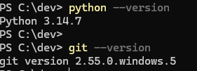
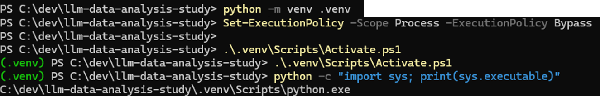
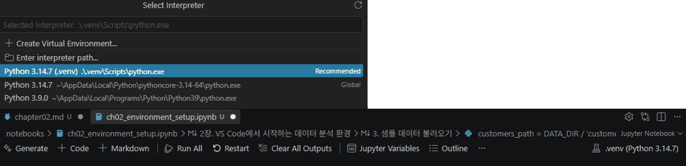
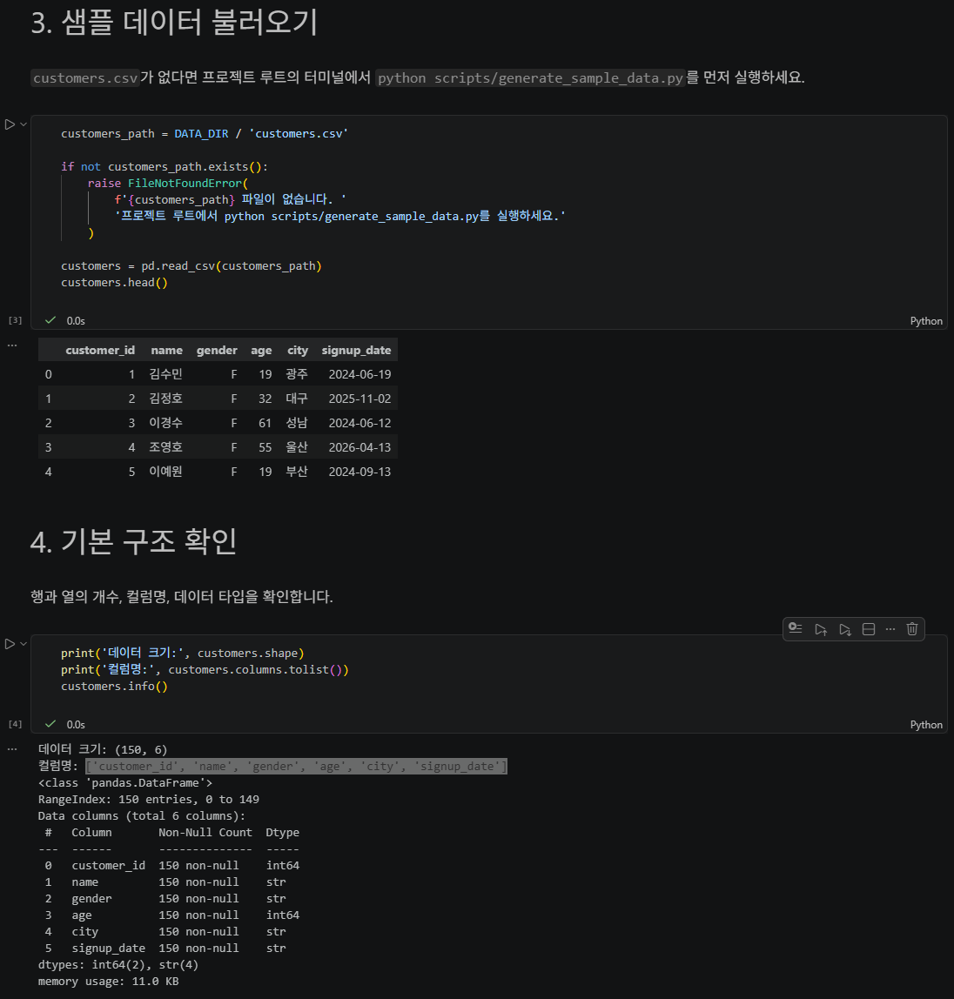
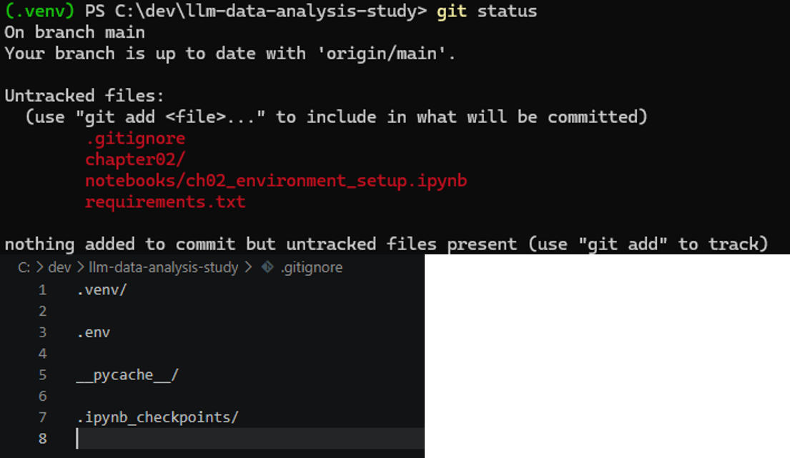

# Chapter 02 제출 답안. VS Code에서 시작하는 데이터 분석 환경

> 최종 파일은 개인 GitHub 저장소의 `chapter02/chapter02.md`로 저장하는 것을 권장합니다.

## 0. 제출 정보

- 이름:김희철
- GitHub ID:KHeeCheol
- 개인 저장소명: `llm-data-analysis-study`
- 작성일:2026-09-16
- 사용한 LLM:chatGPT

### 최종 제출 URL

```text
https://github.com/KHeeCheol/llm-data-analysis-study/blob/main/chapter02/chapter02.md
```

---

## 1. Python과 Git 환경 확인

### 실행 내용

```text
python --version 또는 py --version
git --version
```

### 실행 결과

```text
Python 3.14.7
git version 2.55.0.windows.5
```

### Evidence



### 결과 관찰

python --version, git --version 명령을 실행했을 때 버전 정보가 정상적으로 출력 되었다.
Python과 git을 모두 실행 가능한 상태임을 확인하였다.

### 나의 해석과 판단

Python과 Git이 모두 정상적으로 실행되므로 실습을 진행할 수 있는 환경은 준비되어 있다고 판단하였다

### 업무·분석적 의미

사용하는 Tool의 버전이나 설치상태에 따라 실행결과가 달라질 수 있기 때문에 시작전에 기본적인 환경을 확인해두는 것이
추후 문제발생을 대응할때 재현성이나 문제해결의 측면에서 중요하다.

### 한계와 추가 확인 사항

 Python과 Git이 실행된다는 사실만 확인하였고 jupyter notebook나 vs code가 제대로 작동하는지 프로젝트 환경이 정상적으로
 구성되었는지 확인하지 못하였다.

---

## 2. 저장소와 `.venv` 준비

### 수행 내용

- [O] 공식 Public 저장소 clone
- [O] 프로젝트 루트 확인
- [O] `.venv` 생성
- [O] `.venv` 활성화
- [O] `requirements.txt` 설치

### 핵심 실행 결과

```text
현재 프로젝트 경로:C:\dev\llm-data-analysis-study
터미널 Python 실행 파일:C:\Users\k\AppData\Local\Python\pythoncore-3.14-64\python.exe
가상환경 활성화 여부:(.venv) PS C:\dev\llm-data-analysis-study> 
패키지 설치 결과: requirements.txt 설치 완료
```

### Evidence



### 결과 관찰

`.venv`를 활성화한 뒤 터미널에 `(.venv)`가 표시되는 것을 확인하고 `python -c "import sys; print(sys.executable)"` 명령을 실행하여 이 경로에 현재 공식 실습 프로젝트의 `.venv\Scripts\python.exe`가 포함되어 있는지 확인하였다.

### 나의 해석과 판단

시스템 Python과 프로젝트별 `.venv`를 분리하면 프로젝트마다 필요한 패키지와 버전을 독립적으로 관리할 수 있다. 하나의 Python 환경에 모든 패키지를 설치하면 다른 프로젝트와 충돌할 수 있지만 `.venv`를 사용하면 해당 프로젝트에 필요한 환경을 별도로 유지할 수 있어 오류 가능성을 줄일 수 있다.

### 업무·분석적 의미

`requirements.txt`를 이용하면 다른 PC나 다른 사용자가 동일한 프로젝트를 실행할 때 필요한 패키지를 다시 설치할 수 있어 환경을 재구성하기가 쉬워진다. PC변경상황에서 코드 파일만 전달하는 것보다 필요한 패키지 목록까지 함께 관리하는 것이 환경변경에 의한 오류를 줄일 수 있다.

### 한계와 추가 확인 사항

회사PC에서는 PowerShell 실행 정책이나 설치 권한이 제한될 수 있으므로 시스템 전체 보안 정책을 임의로 변경하지 않도록 주의해야 한다.

---

## 3. VS Code 인터프리터와 Jupyter 커널 연결

### 확인 결과

```text
VS Code Python 인터프리터: C:\dev\llm-data-analysis-study\.venv\Scripts\python.exe
Notebook sys.executable:
Python 실행 파일: c:\Dev\llm-data-analysis-study\.venv\Scripts\python.exe
현재 작업 폴더: c:\Dev\llm-data-analysis-study\notebooks
Notebook Path.cwd():
프로젝트 루트: c:\Dev\llm-data-analysis-study
데이터 폴더: c:\Dev\llm-data-analysis-study\data\raw
데이터 폴더 존재 여부: True
```

### Evidence



### 결과 관찰

터미널에서 확인한 Python 실행 파일과 Notebook에서 `sys.executable`로 확인한 Python 실행 파일의 경로를 확인하고 두 경로가 모두 현재 프로젝트의 `.venv`를 가리키는 것을 확인하였다. VS Code 인터프리터와 Jupyter 커널이 동일한 가상환경에 연결된 것으로 판단할 수 있다.

### 나의 해석과 판단

터미널 Python과 Notebook 커널이 서로 다른 환경을 사용하면 터미널에서 패키지를 정상적으로 설치했더라도 Notebook에서는 해당 패키지를 찾지 못할 수 있다.

### 업무·분석적 의미

실행 환경을 일치시키면 `ModuleNotFoundError`처럼 패키지가 설치되어 있는데도 불러오지 못하는 오류를 줄일 수 있다. 또한 문제가 발생했을 때 `sys.executable`을 확인하면 실제 코드가 어느 Python에서 실행되고 있는지 객관적으로 확인할 수 있어 원인 분석이 쉬워진다.

### 한계와 추가 확인 사항

커널 이름이 비슷하거나 동일해도 다른 위치의 Python을 가리킬 수 있기 때문에, 최종적으로는 `sys.executable`을 직접 출력하여 현재 프로젝트의 `.venv` 경로가 포함되어 있는지 확인하는 것이 필요하다. 또한 Notebook의 `Path.cwd()`는 프로젝트 루트 또는 `notebooks` 폴더가 될 수 있으므로 상대경로를 사용할 때 현재 작업 폴더도 함께 확인해야 한다.

---

## 4. 샘플 데이터와 Notebook 실행 검증

### 확인 결과

```text
DATA_DIR 존재 여부: TRUE
customers.csv 존재 여부: True
customers.shape: (150, 6)
주요 컬럼:['customer_id', 'name', 'gender', 'age', 'city', 'signup_date']
```

### Evidence



### 결과 관찰
`customers.head()`를 실행하여 `customers.csv`의 앞부분이 표 형태로 정상 출력되는지 확인하였다. 또한 `customers.shape`를 통해 데이터의 행과 열 개수 (150, 6)를 확인하고, `customers.columns`를 통해 실제 컬럼명('customer_id', 'name', 'gender', 'age', 'city', 'signup_date')을 확인하였다.  
실제 확인 결과는 다음과 같다.

### 나의 해석과 판단

이 단계까지 정상적으로 실행되었다면 Python, 프로젝트 `.venv`, 설치된 패키지, VS Code, Jupyter Notebook 커널, 작업 경로와 CSV 파일이 기본적으로 정상 연결되었다고 판단할 수 있다. 

### 업무·분석적 의미

분석을 시작하기 전에 간단한 스모크 테스트를 수행하면 환경이나 데이터 경로 문제를 초기에 발견할 수 있다. 분석 코드를 많이 작성한 뒤 문제를 찾는 것보다 초기에 최소한의 입력으로 확인하는 것이 불필요한 디버깅 시간을 줄일 수 있다.


### 한계와 추가 확인 사항

---
현재 단계에서 확인한 것은 데이터파일을 정상적으로 읽어낼 수 있다는 것과 기본 구조 이다. 데이터 자체의 품질은 아직 검증되지 않았으며 다음 단계에서 데이터 품질의 점검과 각 컬럼의 의미 등은 추후에 확인이 필요하다.

## 5. 오류 해결 기록

`해당 없음`

### 오류 메시지

```text
민감정보를 제거한 실제 오류
```

### 원인 후보

1.
2.
3.

### 내가 확인한 순서

1.
2.
3.

### 해결 방법

```text
실제로 적용한 해결 방법
```

### Evidence


### 나의 해석과 판단

왜 해당 원인이 가장 가능성이 높다고 판단했는지 작성하세요.

### 한계와 추가 확인 사항

보안 정책 변경, 무분별한 삭제처럼 시도하지 않은 조치와 이유를 작성하세요.

---

## 6. Secret 보호 확인

- [O] `.env`는 Git 추적 대상이 아닙니다.
- [O] 실제 API Key를 코드에 작성하지 않았습니다.
- [O] 캡처 화면에 Token/비밀번호가 없습니다.
- [O] `.venv`를 Git에 올리지 않습니다.

### Evidence

필요한 경우 `git status`, `.gitignore` 확인 화면을 첨부합니다.



### 나의 해석과 판단

비밀정보는 외부에 노출될 수 있는 위험이 있으므로 반드시 분리해서 관리해야하고 환경파일은 패키지와 기타 실행파일이 들어있어서 git에 업로드하기에 용량도 크고 관리하기도 어렵기 때문에 `requirements.txt`를 통해 필요 패키지를 다시 설치하도록 하는 것이 더 용이하다.

---

## 7. Chapter 02 최종 회고

### 가장 중요했다고 생각한 환경 설정 1가지

```text
프로젝트를 `.venv`를 생성해서 vs code 인터프리터, notebooks 커널을 서로 연결하는 과정
```

### 그 이유

```text
각각의 프로젝트에서 효율적으로 패키지를 활용하기 위해 가상환경을 `.venv`로 만들고 notebook와 vs code 인터프리터를 연결해서 설치한 패키지를 찾지 못하는 문제를 방지하고 오류를 줄일 수 있기 때문이다.
```

### 다음 Chapter에서 재사용할 환경 체크 3가지

1.`sys.executable`을 사용하여 현재 Notebook이 프로젝트 `.venv`의 Python을 사용하는지 확인한다.
2.`Path.cwd()`를 확인하여 상대경로의 기준이 되는 현재 작업 폴더를 확인
3.분석 전에 데이터 파일의 존재 여부를 먼저 확인

### 현재 환경의 한계 또는 주의점

```text
가상환경과 requirements.txt를 사용하더라도 운영체제, Python 버전, 패키지에 따라 다른 PC에서 환경 차이가 생길 수 있다. 회사 PC에서는 실행 정책이나 설치 권한을 임의로 변경하지 않아야 하고 AIP key와 개인정보는 Github에 포함되지 않도록한다.
```

---

## 최종 제출 체크

- [O] 핵심 Evidence 4~7장을 첨부했습니다.
- [O] 단순 캡처가 아니라 관찰과 판단을 작성했습니다.
- [O] Secret/개인정보가 없습니다.
- [O] GitHub에서 이미지가 정상 표시됩니다.
- [O] 개인 저장소에 `chapter02/chapter02.md`를 업로드했습니다.
- [O] 저장소 URL이 아니라 최종 파일 URL을 제출합니다.
